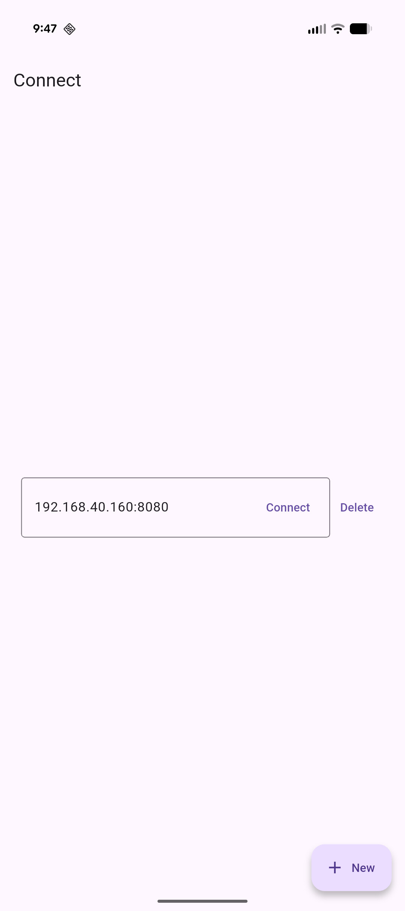
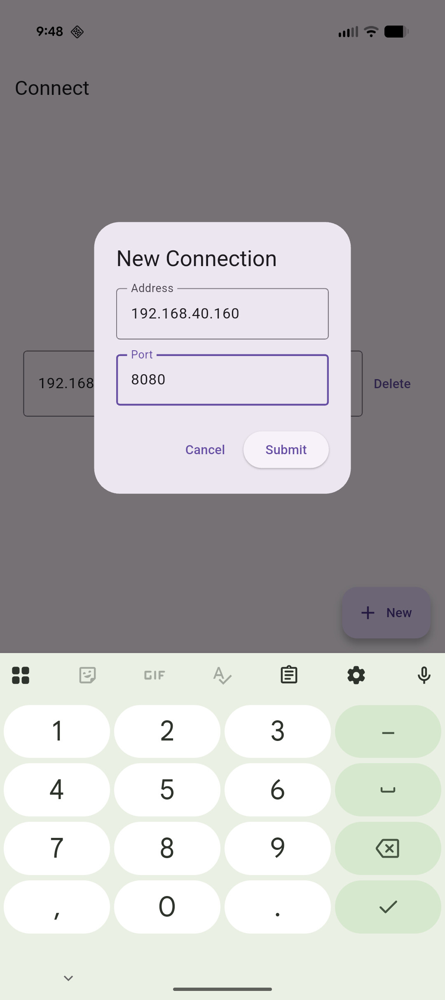
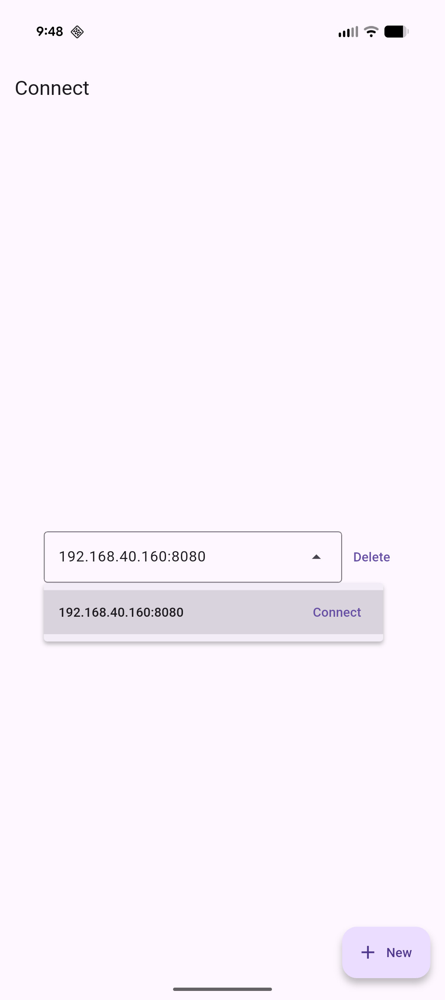
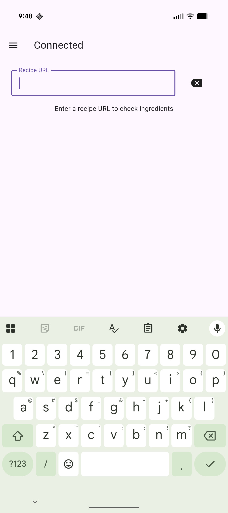
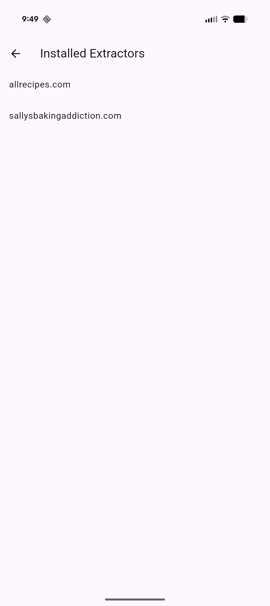
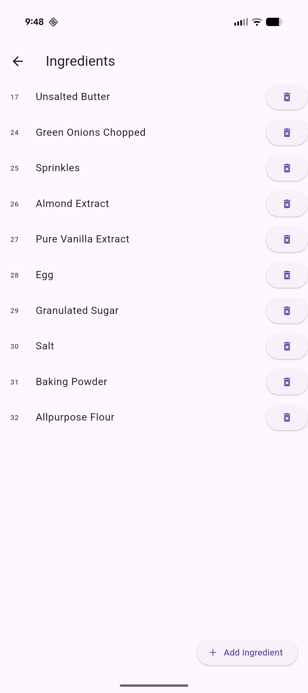
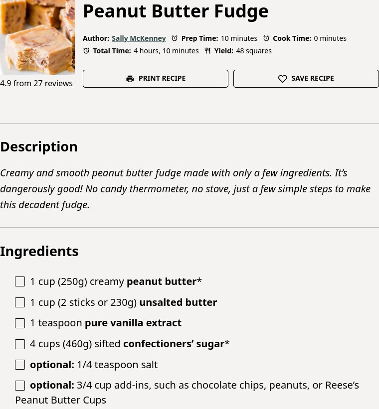
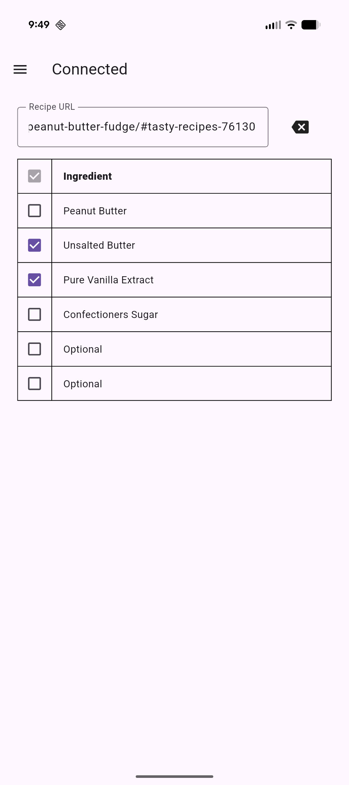
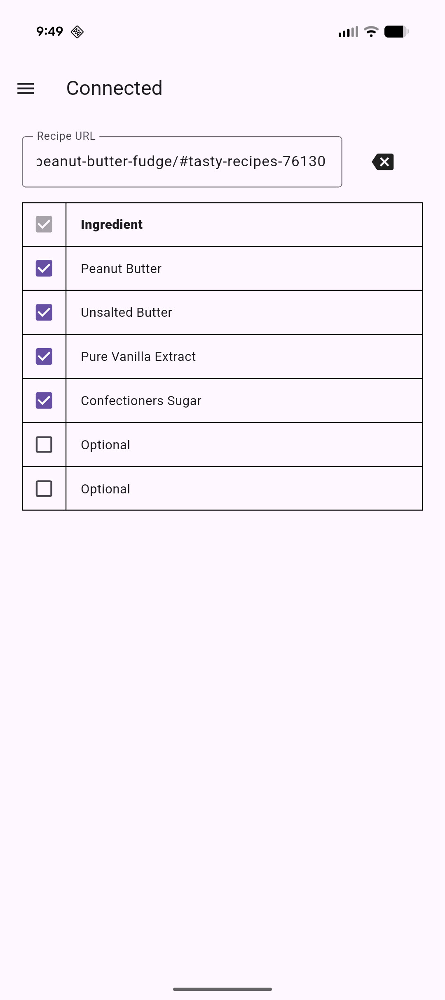
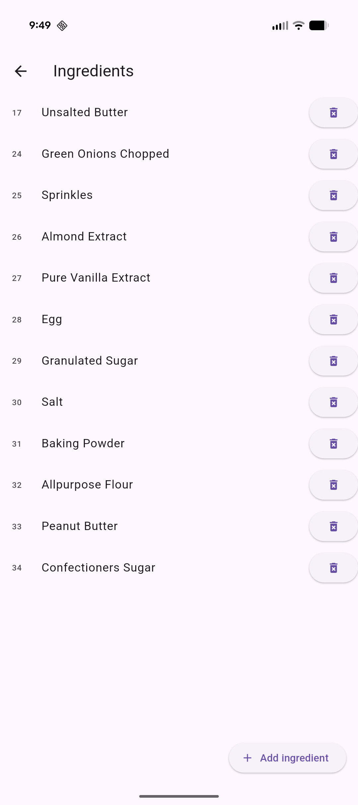

## Frontend  
This is a Flutter project that provides an interface to the pantry inventory backend server. 
Upon connection to a valid server, users are brought to the main page where they may submit recipe URLs for ingredient extraction.

## Screenshots  
|  | 
|:--:| 
| *Starting page for the app.* |

|  | 
|:--:| 
| *Entering connection details for a server.* |

|  | 
|:--:| 
| *Choosing from previously saved connections.* |

|  | 
|:--:| 
| *Main page of the app where recipe URLs may be submitted.* |

|  | 
|:--:| 
| *Extractor listing page where all supported recipe sites are listed.* |

|  | 
|:--:| 
| *The ingredients in the server before the following extraction and updates.* |

|  | 
|:--:| 
| *This is a real screenshot taken from the recipe for [Peanut Butter Fudge](https://sallysbakingaddiction.com/peanut-butter-fudge/#tasty-recipes-76130) from Sally's Baking Addiction.* |

|  | 
|:--:| 
| *The ingredients extracted from the above recipe.* |  

Ingredient extraction is not perfect, and some recipes are not perfectly extracted. In this instance, you can see that there are two entries labeled "`Optional`". That's okay! Users can either ignore them entirely, or check such erroneous entries off as being owned. The table view is meant to be read by a person, not a computer; either option taken will not detract from the app's usefulness. Not every recipe is formatted following the rules expected by an extractor and solving such edge cases is a practice in futility.

|  | 
|:--:| 
| *The table enables checking off ingredients as owned directly.* |

|  | 
|:--:| 
| *Checking the ingredients page, we can verify the new ingredients from the extraction are now listed.* |
